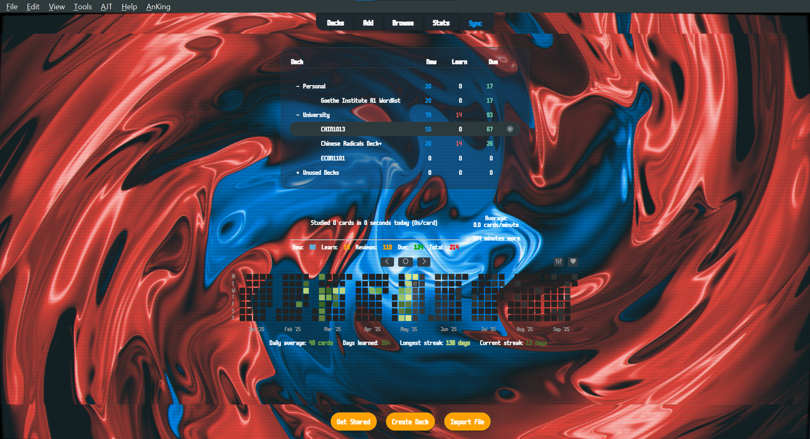
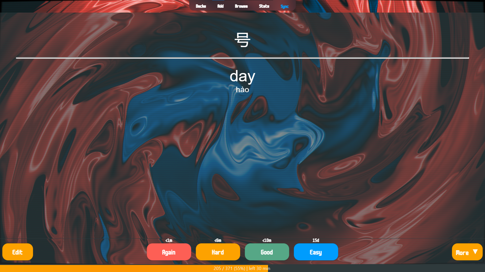
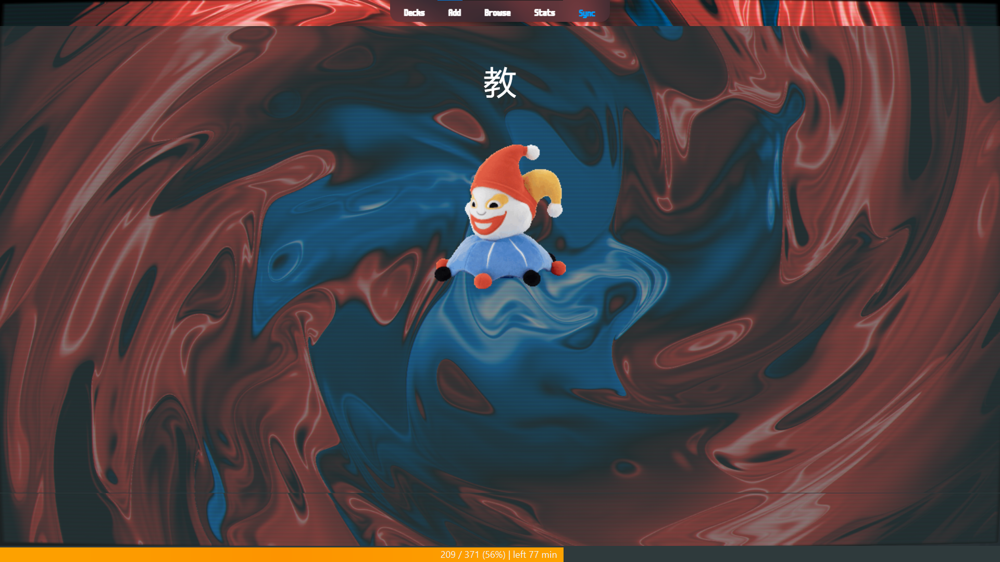
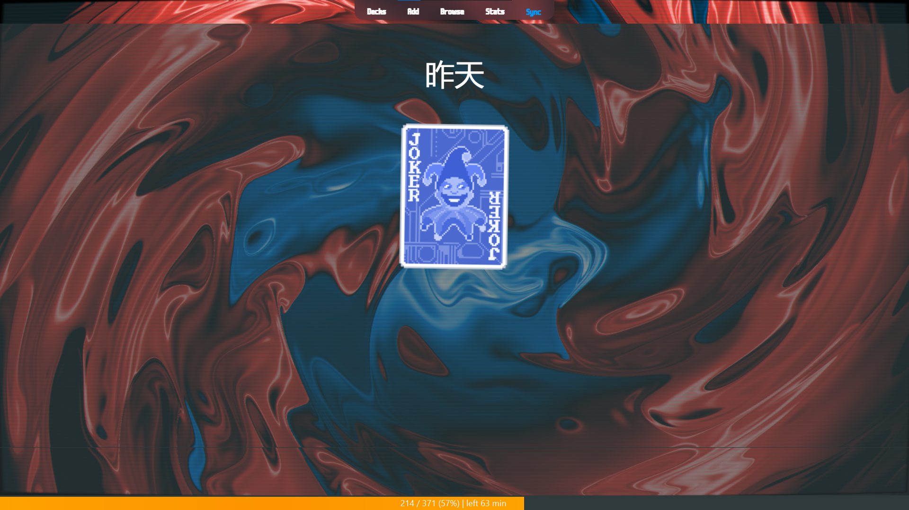

# balanki

This is a collection of audiovisual Anki addon configurations that I've haphazardly put together to make Anki more Balatro-like. Work in progress!

**Configuration overview**
* Custom Background and Gear Image Icon: changed anki review/meny background to hi-res balatro bg render, changed default settings icon to white stake sticker
* Audiovisual Feedback: added Balatro sfx for again/hard/good/easy review options, added Balatro sfx to opening deck/completing deck; ambient game music in main menu, ambient music when reviewing, visual animations and effects on answer/opening deck/completing deck,
* Recolor: themed general ui colours with balatro colour palette
* Change Interface Font: changed to match game font
* Large and Colorful Buttons: changed review button style to match style of balatro ui

## outline
* preview
* installation
* tips
* known issues
* to-do

## preview

## installation
* _to be written... if you know your way around anki customisation, it should be pretty straightforward._

**Required addons:** (_for that balatro feel..._)
* Custom Background and Gear Image Icon (https://ankiweb.net/shared/info/1210908941)
* Audiovisual Feedback (https://ankiweb.net/shared/info/231569866)
* Recolor (https://ankiweb.net/shared/info/688199788)
* Change Interface Font (https://ankiweb.net/shared/info/1431333984) (note - used fonts can be found in the /fonts folder. in the preview screenshots, i've used m6x11plus.tff )
* Large and Colorful Buttons (https://ankiweb.net/shared/info/1829090218)

**Recommended addons:**
* AnkiRestart (https://ankiweb.net/shared/info/237169833) (note - this addon lets you quickly reboot anki with ctrl + shift + r. this is helpful to quickly reflect changes in your customisation and quickly debug any issues.)
* Review Heatmap (https://ankiweb.net/shared/info/1771074083) (note - shown in preview.)
* Progress Bar by Shige (https://ankiweb.net/shared/info/1708250053) (note - shown in preview.)

## tips
When reviewing, full-screen mode is recommmended for improved visual aesthetics.

## known issues

## to-do
* make read-mes for each folder
